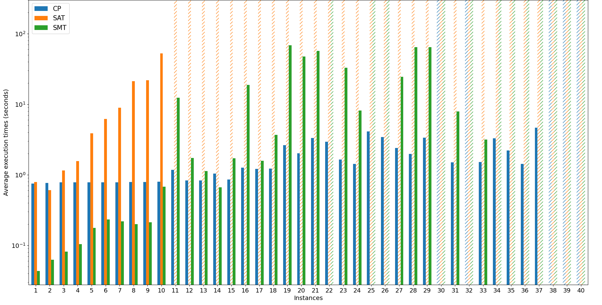

# VLSI

**VLSI** (_Very Large Scale Integration_) is the process of integrating **circuits** into silicon **chips**. Technological progress has made it possible to **decrease the transistors' size** and this has **pushed the integration** of more and more transistor into a single chip, allowing modern smartphones to include many advanced features in such small devices. In order to keep acceptable sizes, a proper choice of the **spatial arrangement** of the transistors must be done. This is the problem addressed in this paper.
The proposed solution is based on the intuition of **dealing with a single dimension of the problem first**, as if it was a **task scheduling** constraint problem. Then, using the partial solution as an additional constraint, the other dimension will be approached, resulting in a smaller search-tree.

[**You can check the report here.**](https://github.com/TeamFanAli/VLSI/blob/main/Report.pdf)



## Installation and usage

Install all the requirements using

```
$ pip install -r requirements.txt
```

You can find **four folders** in this project: **CP** contains the MiniZinc implementation, **SAT** the SAT solver implementation, **SMT** the SMT implementation. Each of these folders then contains the files for the model and a Python script, **named as the repo**, that is used to start the optimization. Finally, the **output** folder contains the solution provided by the CP implementation, as this was the most performing one. Some instances (as seen in the graph) reached the timeout of 5 minutes, and are **suboptimal**.

## CP

Usage:

```
CP.py [-h] [-r] [-s {chuffed,gecode}] [-o {0,1,2,3,4,5}] [-p PROCESSES] [--output OUTPUT] [-to] [-v {0,1,2}] file
```

Positional arguments:

| arg  | explanation                      |
| ---- | -------------------------------- |
| file | the file containing the instance |

Optional arguments:

| arg                                            | explanation                                                                                   |
| ---------------------------------------------- | --------------------------------------------------------------------------------------------- |
| -h, --help                                     | show help message and exit                                                                    |
| -r, --rotation                                 | allows to rotate circuits                                                                     |
| -s {chuffed,gecode}, --solver {chuffed,gecode} | CP solver of the mzn model, default is chuffed                                                |
| -o {0,1,2,3,4,5}, --optimization {0,1,2,3,4,5} | set the MiniZinc compiler optimisation level, default is 1: single pass optimization          |
| -p PROCESSES, --processes PROCESSES            | set the number of processes the solver can use, default is 1, chuffed supports only 1 process |
| --output OUTPUT                                | the file in which store the output, if not specified it will be printed on the console        |
| -to, --text_only                               | do not show the graphic visualization of the solution                                         |
| -v {0,1,2}, --verbosity {0,1,2}                | 0: execution times, 1: +solution (default), 2: +statistics                                    |

## SAT

Usage:

```
SAT.py [-h] [-r] [--output OUTPUT] [-to] [-v {0,1}] file
```

Positional arguments:

| arg  | explanation                      |
| ---- | -------------------------------- |
| file | the file containing the instance |

Optional arguments:

| arg                         | explanation                                                                            |
| --------------------------- | -------------------------------------------------------------------------------------- |
| -h, --help                  | show help message and exit                                                             |
| -r, --rotation              | allows to rotate circuits                                                              |
| --output OUTPUT             | the file in which store the output, if not specified it will be printed on the console |
| -to, --text_only            | do not show the graphic visualization of the solution                                  |
| -v {0,1}, --verbosity {0,1} | 0: execution time, 1: times of iterations                                              |

## SMT

Usage:

```
SMT.py [-h] [-r] [--output OUTPUT] [-to] [-v {0,1}] file
```

Positional arguments:

| arg  | explanation                      |
| ---- | -------------------------------- |
| file | the file containing the instance |

Optional arguments:

| arg                         | explanation                                                                            |
| --------------------------- | -------------------------------------------------------------------------------------- |
| -h, --help                  | show help message and exit                                                             |
| -r, --rotation              | allows to rotate circuits                                                              |
| --output OUTPUT             | the file in which store the output, if not specified it will be printed on the console |
| -to, --text_only            | do not show the graphic visualization of the solution                                  |
| -v {0,1}, --verbosity {0,1} | 0: execution time, 1: spinners and other fancy things                                  |

## Performances

Check
